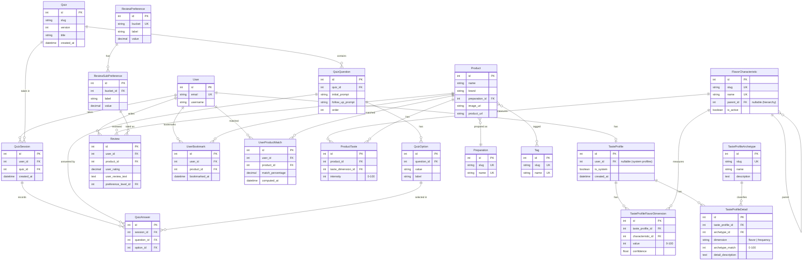

```mermaid
erDiagram
    User ||--o| TasteProfile : "has"
    User ||--o{ QuizSession : "takes"
    User ||--o{ Review : "writes"
    User ||--o{ UserBookmark : "bookmarks"
    User ||--o{ UserProductMatch : "matched"

    TasteProfile ||--o{ TasteProfileFlavorDimension : "has"
    TasteProfile ||--o{ TasteProfileDetail : "has"

    FlavorCharacteristic ||--o{ FlavorCharacteristic : "parent"
    FlavorCharacteristic ||--o{ TasteProfileFlavorDimension : "measures"
    FlavorCharacteristic ||--o{ ProductTaste : "measures"

    TasteProfileArchetype ||--o{ TasteProfileDetail : "classifies"

    Product }o--|| Preparation : "prepared as"
    Product }o--o{ Tag : "tagged"
    Product ||--o{ ProductTaste : "has"
    Product ||--o{ Review : "reviewed"
    Product ||--o{ UserBookmark : "bookmarked"
    Product ||--o{ UserProductMatch : "matched"

    Quiz ||--o{ QuizQuestion : "contains"
    Quiz ||--o{ QuizSession : "taken in"
    QuizQuestion ||--o{ QuizOption : "has"
    QuizSession ||--o{ QuizAnswer : "records"
    QuizQuestion ||--o{ QuizAnswer : "answered by"
    QuizOption ||--o{ QuizAnswer : "selected in"

    ReviewPreference ||--o{ ReviewSubPreference : "has"
    ReviewSubPreference ||--o{ Review : "rated as"

    User {
        int id PK
        string email UK
        string username
    }

    TasteProfile {
        int id PK
        int user_id FK "nullable (system profiles)"
        boolean is_system
        datetime created_at
    }

    TasteProfileFlavorDimension {
        int id PK
        int taste_profile_id FK
        int characteristic_id FK
        int value "0-100"
        float confidence
    }

    TasteProfileDetail {
        int id PK
        int taste_profile_id FK
        int archetype_id FK
        string dimension "flavor | frequency"
        int archetype_match "0-100"
        text detail_description
    }

    TasteProfileArchetype {
        int id PK
        string slug UK
        string name
        text description
    }

    FlavorCharacteristic {
        int id PK
        string slug UK
        string name UK
        int parent_id FK "nullable (hierarchy)"
        boolean is_active
    }

    Product {
        int id PK
        string name
        string brand
        int preparation_id FK
        string image_url
        string product_url
    }

    Preparation {
        int id PK
        string slug UK
        string name UK
    }

    Tag {
        int id PK
        string slug UK
        string name UK
    }

    ProductTaste {
        int id PK
        int product_id FK
        int taste_dimension_id FK
        int intensity "0-100"
    }

    Quiz {
        int id PK
        string slug
        int version
        string title
        datetime created_at
    }

    QuizQuestion {
        int id PK
        int quiz_id FK
        string initial_prompt
        string follow_up_prompt
        int order
    }

    QuizOption {
        int id PK
        int question_id FK
        string value
        string label
    }

    QuizSession {
        int id PK
        int user_id FK
        int quiz_id FK
        datetime created_at
    }

    QuizAnswer {
        int id PK
        int session_id FK
        int question_id FK
        int option_id FK
    }

    Review {
        int id PK
        int user_id FK
        int product_id FK
        decimal user_rating
        text user_review_text
        int preference_level_id FK
    }

    ReviewPreference {
        int id PK
        string bucket UK
        string label
        decimal value
    }

    ReviewSubPreference {
        int id PK
        int bucket_id FK
        string label
        decimal value
    }

    UserProductMatch {
        int id PK
        int user_id FK
        int product_id FK
        decimal match_percentage
        datetime computed_at
    }

    UserBookmark {
        int id PK
        int user_id FK
        int product_id FK
        datetime bookmarked_at
    }
```
